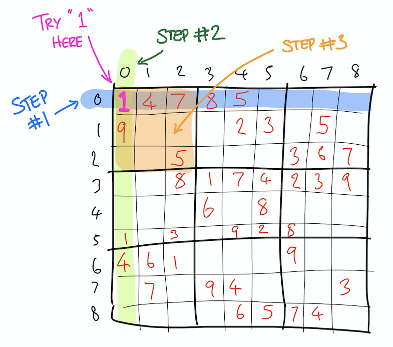
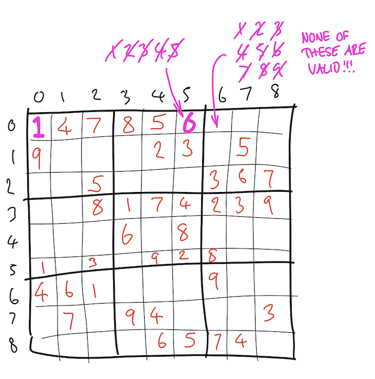

# Sudoku Solver

This is a simple Python script that solves Sudoku puzzles. It solves the puzzle by essentially "brute force".

## Files and Folders

The important files and folders are described here:

``` text
.
├── puzzles                 # folder containing example suduko grids, and their solutions
├── solve.py                # the main entry point for this app
├── solver                  # module that contains all the interesting code
│   └── sudoku_solver.py    # the "guts" of the app
└── tests                   # folder containing pytest unit tests
```

## How it Works

The concept it pretty simple:

1. Try a number from 1 to 9 in the next empty space in the grid.
2. If that number fits, go on to the next empty cell and do the same thing.
3. If that number doesn't fit, try the next number until you find one that fits.
4. If you can't find any number that fits, go back (back-track) to the last empty cell and try the next number.
5. Keep backtracking, and trying numbers, until you find numbers that fit.
6. When you get to the end of the grid, then you're done!

The code here uses a concept called [Backtracking](https://en.wikipedia.org/wiki/Backtracking) to try values in the grid, and backtrack when those values fail to provide a valid solution.

Within the code, there are two functions that do all of the "interesting" work:

### The `solve_grid` function

```python
def solve_grid(grid)
```

The function `solve_grid` takes a grid (an array of arrays, loaded by `load_grid`) and solves it.
This is the function that implements the back-tracking, and calls itself recursively. 
The `solve_grid` function calls `is_valid_solution` to deterimine if a number can be placed in the grid.

### The `is_valid_solution` function

```python
def is_valid_solution(grid, row, col, solution):
```

This function takes a grid, the row and column in that grid, and a potential solution (a number from 1 to 9), and
determine if that potential solution is valid within that position in the grid.

## A Worked Example

Take this example grid. This is a 9x9 sudoku grid, where empty/unknown cells are represented by `0`.
You can find this file in the file `puzzles\puzzle-1-grid.txt`.

``` text
047850000
900023050
005000367
008174239
000608000
104092800
461000900
070940003
000065740
```

The very first cell has a `0` and so the first thing that `solve_grid` will do here is try potential solutions in this cell, starting with `1`:



The `solve_grid` function calls `is_valid_solution` which, in turn, checks whether the number `1` can be placed here. It does this in three steps:

1. Check whether `1` can exist in this row
2. Check whether `1` can exist in this column
3. Check whether `1` can exist in this 3x3 block of cells

In this case, these checks all pass and the function returns `True`.

So, `1` is a valid value for this cell, and the `solve_grid` function moves on to the next empty cell.

Now, let's jump forward a few cells. The code tries `1`, `2`, `3`, `4` and `5` in the next empty cell. 
Each of these is an invalid solution. We find that `6` is valid, and so we move on to the third empty cell.



**HOWEVER** when we try solutions in this cell, we find that none of the numbers from 1 to 9 are valid - all of themc
clash with values in the row, the coloumn, and the 3x3 grid! This is where the backtracking comes in, as `solve_grid` returns `False`, and this causes the caller (the previous instance of `solve_grid` on the stack) to replace the current
solution (`6`) with the next potential solution (in this case, `7`).


The value `7` is valid, and so the algorithm goes on.

You can see the solution to this grid in `puzzles/puzzle-1-solution.txt`. Here's the solution:

```text
347856192
916723458
285419367
658174239
729638514
134592876
461387925
572941683
893265741
```

What you might notice here is that the number in the first cell is a `3` and not a `1`. This is because, as the grid is being solved, the algorith has had to back track all the way to the first cell and change it from `1` to `2`, and then from `2` to `3` in its quest to find a solution to the grid.
